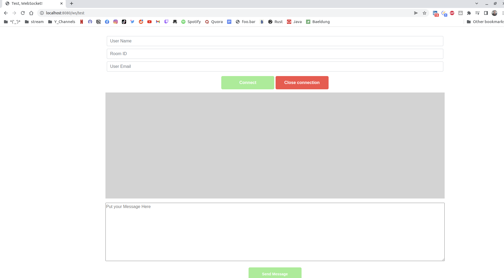
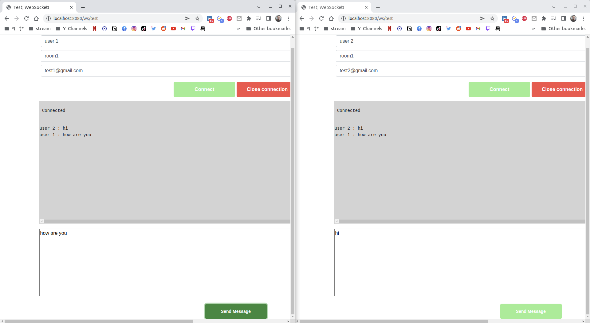

# chat-test


## Apis :

<!-- TABLE OF CONTENTS -->
## Table of Contents

- [Overview:](#About-The-Project)
- [Project Architecture](#project-architecture)
- [Folder Structure](#folder-structure)


## About The Project
`CHAT-TEST` is a pure [Golang][Golang] project, that manage a dead simple "chat" system. 

* `Server`: Receiving messages from a network interface (WebSocket) and forwarding them to all the connected clients
* `Client`: A process reading a string on `STDIN` and forwarding it to the server, and also receiving messages from the same server and writing them to `STDOUT`.


### Built With

* [Golang][Golang]
* [REST][REST]

<!-- PROJECT ARCHITECTURE -->
## Project Architecture

### Folder Structure

```
.
├── go.mod
├── go.sum
├── internal
│   └── path.go
├── main.go
├── README.md
├── vendor
└── server
    ├── handlers.go
    ├── response.go
    ├── server.go
    ├── view
    │   └── chat_client.html  //chat client implementation `javaScript` web Socket.
    ├── ws_client.go
    ├── ws_hub.go
    └── ws_room.go

```

## Entities

> This section will describe the entities of `CHAT-TEST` service

### Hub :
the Hub entity manage set of chat room life cycle:
 * register  set of chat rooms.
 * unregister  any  closed room.

 ```go
 type Hub struct {
	// Registered clients.
	rooms map[*Room]bool //check this bool!!

	// Register requests from the Rooms.
	register chan *Room

	// Unregister requests from Rooms.
	unregister chan *Room
}
 ```

 ### Room :
 the Room entity manage  set of the web socket connections (web socket clients).
 
 ```go
 // Room is a middleman between the Client and the hub.
type Room struct {
	ID uuid.UUID

	hub *Hub

	roomID string

	RoomType RoomType

	clients map[*Client]bool

	// Inbound messages from the clients.
	broadcast chan string

	// Register requests from the clients.
	register chan *Client

	// Unregister requests from clients.
	unregister chan *Client
}
 ```

 ### Client:

 simple websocket  connection.

 ```go
 // Client is a middleman between the websocket connection and the hub.
type Client struct {
	ID uuid.UUID

	userEmail string

	room *Room

	// The websocket connection.
	conn *websocket.Conn

	// Buffered channel of outbound messages.
	send chan string
}

 ```


 ## JavaScript Client:

 >`Client`: A process reading a string on `STDIN` and forwarding it to the server, and also receiving messages from the same server and writing them to `STDOUT`.


 > to test the chat-server we are using    javascript web socket client:

 ```javascript
        
        function connect() {
            
            var room_id = document.getElementById("room_id").value;
            var user_email = document.getElementById("user_email").value;
            var url = "ws://localhost:8080/ws/chat-server?room_id=" + room_id + "&user_email=" + user_email;

            console.log(url);

            socket = new WebSocket(url);

            socket.onopen = function () {
                output.innerHTML += "<div class=\"row\"> <div class=\"col\"> <p> Connected </p> </div></div>";
            };

            socket.onmessage = function (e) {
                output.innerHTML += "<div class=\"row\"> <div class=\"col\">" +
                    prettifyJson(e.data, true) +
                    "</div></div>";
            };

            socket.onclose = () => {
                console.log('Web Socket Connection Closed');
            };
        }

        function disconnect() {
            if (socket != null) {
                socket.close();
            }

        }

        function sendMessage() {
            if (socket == null) {
                console.log('Web Socket Connection Closed');
            }
            var user_name= document.getElementById("user_name").value;
            var msg = document.getElementById("msgToServer").value;
            socket.send(String(user_name)+" : "+msg);
        }

 ``` 
****

to test this project:

in project repository run 
```console
go mod tidy
go mod vendor
go run main.go
```

set the `room` name  and  user name and email than click on connect
> for  two or more user  coonect with each other you should connect with same room name.



****

`user` :  user1 & user2 talk with each other in the room `room1`




****

 Also you can use this link to test server:

  [Test WebSocket Servers](https://www.piesocket.com/websocket-tester)
